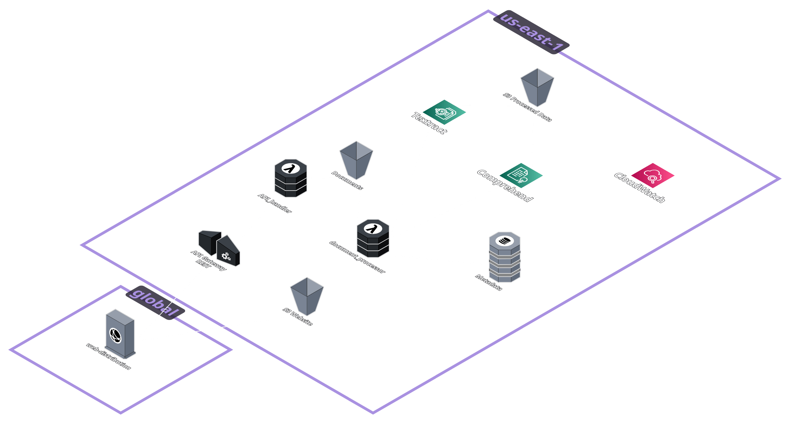
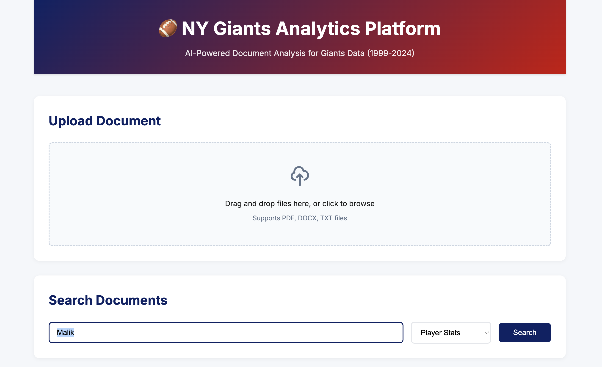
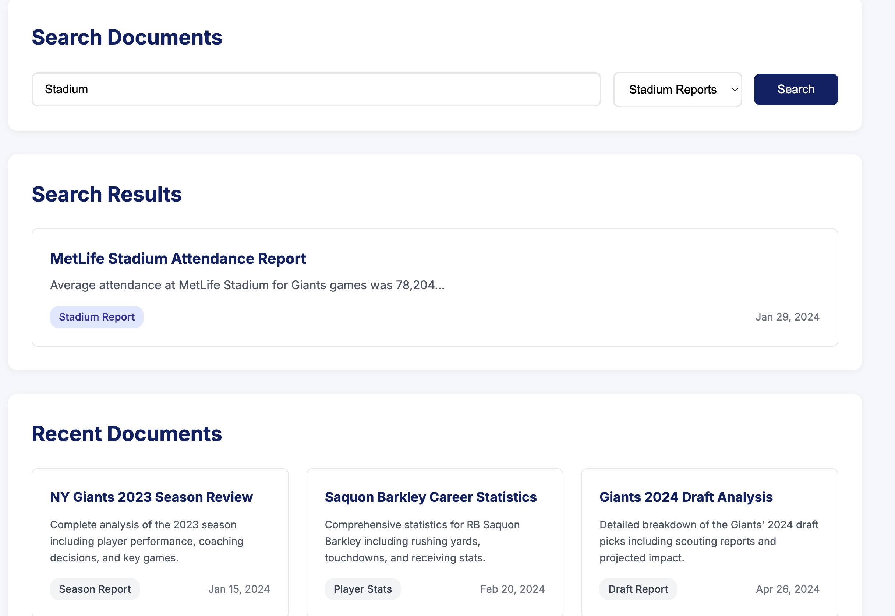

# 🏈 Intelligent Sports Analytics Pipeline


🔗 **Not Live:** Infrastructure deployed successfully but has been decommissioned to avoid AWS charges. See [technical evidence](docs/technical-evidence.md) for deployment proof.

## 📋 Project Overview

This project implements an AI-powered document analysis pipeline specifically designed for New York Giants data (1999-2024). Built with Terraform and leveraging AWS AI services, it automatically processes sports documents, extracts insights, and provides searchable analytics through a serverless architecture.

The system showcases Infrastructure as Code best practices, modern cloud architecture patterns, and enterprise-grade AI integration while remaining within AWS free tier limits.

---

## ✅ Key Features & Services

- 🚀 **Infrastructure as Code** - Complete AWS infrastructure defined in Terraform
- 🤖 **AI-Powered Analysis** - Amazon Textract for OCR and Comprehend for NLP
- ⚡ **Serverless Architecture** - Event-driven Lambda functions with S3 triggers
- 🌐 **Global CDN** - CloudFront distribution for low-latency access
- 🔐 **RESTful API** - API Gateway with proper resource structure
- 💾 **NoSQL Database** - DynamoDB for metadata and search capabilities
- 📊 **Monitoring** - CloudWatch dashboards and structured logging
- 🎯 **Sports-Specific** - Tailored for Giants player stats, game reports, and draft analysis

---

## 🗺️ Architecture Overview



The architecture follows AWS Well-Architected Framework principles, implementing a fully serverless solution that scales automatically and operates within free tier limits when idle.

---

## 📁 Project Structure

```
intelligent-sports-analytics-pipeline/
├── terraform/                    # Infrastructure as Code
│   ├── environments/
│   │   └── dev/
│   │       ├── main.tf          # Main Terraform configuration
│   │       ├── variables.tf     # Variable definitions
│   │       ├── outputs.tf       # Output values
│   │       └── terraform.tfvars # Environment variables
│   └── modules/                 # Reusable Terraform modules
├── scripts/                     # Build and deployment scripts
│   ├── lambda_functions/        # Lambda function code
│   │   ├── document_processor.py
│   │   └── api_handler.py
│   ├── build-lambda-layer.sh    # Dependency packaging
│   └── build-lambda-functions.sh # Function packaging
├── web/                         # Frontend application
│   ├── index.html              # Main interface
│   ├── styles.css              # Styling
│   ├── script.js               # Frontend logic
│   └── error.html              # Error page
├── sample-data/                 # Giants test data
│   ├── giants-2023-season-summary.json
│   ├── player-saquon-barkley-stats.json
│   ├── giants-2024-draft-analysis.json
│   └── metlife-stadium-report.txt
├── architecture/                # Architecture diagrams
│   ├── intelligent-sports-analytics-architecture.png
│   └── screenshots/            # Application screenshots
├── docs/                        # Additional documentation
│   ├── technical-evidence.md    # AWS deployment evidence
│   └── evidence/               # Technical screenshots
├── .gitignore                   # Git ignore configuration
└── README.md                    # Project documentation
```

---

## 🖥️ Application Demo

### Main Interface


### Search Functionality


---

## 🚀 Deployment Process

### Prerequisites

- AWS CLI configured with credentials
- Terraform v1.5+ installed
- Python 3.9+ for Lambda development
- Node.js for frontend testing

### Step 1: Clone the Repository

```bash
git clone https://github.com/jimmyperalta-dev/intelligent-sports-analytics-pipeline.git
cd intelligent-sports-analytics-pipeline
```

### Step 2: Build Lambda Packages

```bash
cd scripts
./build-lambda-layer.sh
./build-lambda-functions.sh
```

### Step 3: Deploy Infrastructure

```bash
cd ../terraform/environments/dev
terraform init
terraform plan
terraform apply
```

### Step 4: Deploy Frontend

```bash
cd ../../../web
aws s3 sync . s3://$(terraform -chdir=../terraform/environments/dev output -raw website_bucket_name)
```

### Step 5: Access the Application

After deployment, Terraform outputs will provide:
- CloudFront URL for web access
- API Gateway endpoint for direct API calls
- Resource identifiers for monitoring

---

## 🧠 Skills Demonstrated

- **Infrastructure as Code** - Advanced Terraform with modular design
- **Serverless Architecture** - Event-driven Lambda functions
- **AI/ML Integration** - AWS Textract and Comprehend
- **API Development** - RESTful design with API Gateway
- **Frontend Development** - Modern JavaScript with AWS SDK
- **DevOps Practices** - Automated builds and deployments
- **Cloud Security** - IAM roles, encrypted storage, HTTPS
- **Monitoring** - CloudWatch dashboards and logging
- **Cost Optimization** - Free tier awareness and on-demand billing

---

## 💰 Cost Analysis

Designed to operate within AWS free tier:

- **Lambda**: 1M requests/month free
- **API Gateway**: 1M API calls/month free
- **S3**: 5GB storage, 20K GET requests free
- **DynamoDB**: 25GB storage, on-demand billing
- **CloudFront**: 50GB data transfer free

Estimated monthly cost: **$0** with minimal usage

---

## 📝 Lessons Learned

- **Terraform State Management** - Remote state with S3 backend prevents conflicts
- **Lambda Layers** - Reduce deployment size and improve cold start performance
- **Event-Driven Architecture** - S3 triggers provide reliable document processing
- **AI Service Integration** - Textract/Comprehend require specific IAM permissions
- **Free Tier Optimization** - Careful service selection keeps costs minimal

---

## 🔗 Related Projects

- [Serverless REST API with DynamoDB](https://github.com/jimmyperalta-dev/aws-serverless-dynamodb-api)
- [Containerized Application on AWS ECS Fargate](https://github.com/jimmyperalta-dev/aws-ecs-fargate-application)
- [CI/CD Pipeline with AWS CodePipeline](https://github.com/jimmyperalta-dev/aws-cicd-pipeline-infrastructure)
- [Static Website Deployment on AWS](https://github.com/jimmyperalta-dev/aws-s3-static-website)

---

## 📚 Additional Resources

- [Technical Evidence](docs/technical-evidence.md) - Detailed AWS deployment proof
- [Terraform AWS Provider](https://registry.terraform.io/providers/hashicorp/aws/latest)
- [AWS Lambda Best Practices](https://docs.aws.amazon.com/lambda/latest/dg/best-practices.html)
- [Amazon Textract Documentation](https://docs.aws.amazon.com/textract/)
- [Amazon Comprehend Documentation](https://docs.aws.amazon.com/comprehend/)

---

## </> Development Notes

This project was developed with assistance from Claude to code and enhance documentation quality. All implementations were validated and tested by me.

---

## 👤 Author

**Jimmy Peralta**  
🛠️ Associate Media Systems Engineer | ☁️ AWS Cloud Enthusiast  
🌐 [https://www.deployjimmy.com](https://www.deployjimmy.com)
